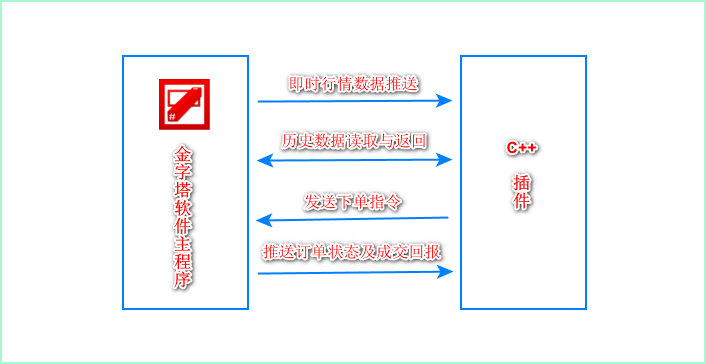

## 使用金字塔C++ API开发策略的优势
C++语言无论是灵活性和安全性都是要比传统一般意义上的脚本语言要强大许多，很多专业投资者及一些投资机构都喜欢使用C++直接编写交易策略，。使用C++开发策略需要3个主要组件，如下：
1. 历史行情数据的管理和接收 
2. 交易策略的评估与实现
3. 下单交易具体实施
实际上上述3块已经是程序化软件的基本模块，若要重新开发一套这样的产品或策略，将耗费很大的精力与财力来维护管理。

如果使用金字塔平台进行C++的策略编写，那么上述的多个难点就可以得到很好的解决，主要如下：
1. 金字塔为C++接口提供了丰富完善的历史数据，包括盘中即时数据，1分，5分，15，30，日线等等多大十几种周期数据，这些数据都是金字塔软件统一管理，模型的开发者不必再来操心历史数据如何管理。
2. 金字塔的所有即时行情报价数据均为全推数据，包含了所有沪深股市的所有股票即时报价，所有期货、股票、期权、外盘品种的所有数据报价，这么大量的全推数据全都由金字塔一个平台来为你完成。
3. 我们的交易策略在前期模型阶段可以利用金字塔平台PEL语言快速的进行评估，评估结束后，再集中精力来变成C++的具体交易算法，节省了大量的时间。
4. 可以利用金字塔平台进行全球市场交易；虽然现在CTP平台开放了交易接口，但毕竟是只有这一个接口，如果交易者要对其他的交易接口例如金仕达、恒生接口等等时，都必须要去重新开发接口，同样是要花费很大的精力。但如果使用金字塔平台，开发者就不必再去关心不同的交易接口到底有哪些不同，我们都已经为客户封装好了统一的交易接口规范，你只要交易策略编写完毕后，就可以在金字塔所支持的国内期货公司，证券公司，外盘期货外汇等等平台上进行交易。
综上所述，实际上很多底层的服务模块金字塔都已经为客户开发好了，客户在金字塔上只需要关心如何用C++编写策略就可以，极大的加快了投资者的开发周期，并节省了大量的研发费用。

## 金字塔的C++ API与主程序的组织结构


<div class="tip_img_wrap">
　　
</div>


## 金字塔的接口范例下载与简要说明

使用本教程前，请 [下载范例](http://www.weistock.com/download/addindemo.rar) ，本教程的所有说明代码均以该范例模板为基础，同时也建议客户直接在本范例代码框架下开发您的策略。另外金字塔的安装目录AddinDemo.rar 压缩文件也包含了此范例代码。

1. 软件所有暴露的接口均封装在IMainFramework接口类中.
2. 该接口类通过软件启动后进行初始化，范例模板为标准的DLL格式架构.
3. 为了避免与金字塔的系统DLL冲突，编译后的扩展名必须为 *.adi.
4. 编译完毕后放到金字塔的工作主目录下，通过菜单栏【工具】--【C++扩展】中能查看插件；
5. 范例中的插件名称为`下撤单演示插件`你可以通过暴露的 GetAddinName 全局API接口来修改它。

::: warning  注意
如果是x64模式的金字塔版本,请将你的DLL也编译成64位版本才可以使用。
:::

## API接口报价行情订阅

```cpp
//注册沪铜行情数据
g_pMainFormework->RegReportNotify("CU00",'QS');
 //注册上证指数行情数据
g_pMainFormework->RegReportNotify("000001",'HS');
```
::: tip 参数
- 参数1：合约代码为金字塔合约代码，如果不熟悉可以在动态牌上查看，
- 参数2：为市场标识，'QS'上海期货市场,市场代码表示是一个WROD类型的,字符显示是 "SH", 到了WORD 就为 'HS'
:::

具体每个市场的代码在菜单栏【工具】--【市场与板块】中,查看市场的代号,设置和进行管理.


## 报价行情变化通知

金字塔的所有推送的事件(行情报价订阅，订单状态)变化通知都是在 范例中的 CMainWindowDlg::OnNotifyUpdate 中实现的，其中订阅行情报价代码段在下面范例中：

```cpp
LRESULT CMainWindowDlg::OnNotifyUpdate(WPARAM w,LPARAM l)
{
 if(w == 2)
   {
 //注册品种报价变化通知
ReportUpdate(l);
 }
}
```
当w=2时，l参数为REPORT_STRUCT结构体的数据结构，REPORT_STRUCT数据结构体见代码范例AddinInterface.h头文件描述。

## 获取指定市场全部合约报价

考虑到效率问题，金字塔对订阅的品种数量是有限制的，具体版本如下：

::: tip 数量限制
- 免费普通版3个
- 标准版10个
- 专业版及其以上版本20个
:::

- 既然金字塔数据是全推数据，那么我们怎么能盘中及时得到全部品种的报价呢？<br>
答案当然是肯定可以的了，我们在API中提供了`GetReportCount(WORD wMarket)`函数，通过该函数我们可以得到指定市场的品种数量，然后通过GetReportData函数遍历整个市场的品种合约，最后通过REPORT_STRUCT * GetReportData函数来获取遍历合约的行情报价数据。

```cpp
//遍历整个市场的品种合约
GetReportData(WORD wMarket, DWORD dwIndex, char * szCode)

//获取遍历合约的行情报价数据
REPORT_STRUCT * GetReportData(char * szLabel, WORD wMarket)
```

## 历史数据的获取

历史数据接口函数为`GetDataInfo(PCALCINFO * pInfo)`，其中PCALCINFO 结构是描述获取数据的信息，详细介绍请参考代码范例AddinInterface.h头文件描述。部分范例如下：
```cpp
//读取上海市场的600000日线数据范例
 PCALCINFO stData = {0};
 stData.m_dataType = DAY_DATA;//日线
 stData.m_bIsPow = 1; //是否复权
 stData.m_wMarket = 'HS';
 strcpy(stData.m_szLabel,"600000"); //读取600000 浦发银行数据
 
 if(g_pMainFormework->GetDataInfo(&stData))
 {

 CString strText;
  for(int i = 0; i < stData.m_nNumData; i++)
  {
   strText.Format("数据:%f",stData.m_pMainData[i].m_fClose); 
   //通过日志记录文件将数据写盘
  LOG_DEBUG_INFO( "c:\\MyData.txt", "数据 %s", strText);
  }
  strText.Format("共取到%d个数据",stData.m_nNumData);
  AfxMessageBox(strText);
 } 
```

## 下单委托指令

通过 PlaceOrder 接口函数即可完成向金字塔主程序发送下单指令的动作，金字塔支持的所有期货、证券公司柜台只通过这一个函数下委托指令就可以了，介于该函数参数较多，建议直接参考AddinInterface.h头文件描述。


## 订单状态推送回报


金字塔的所有推送的事件(行情报价订阅，订单状态)变化通知都是在 范例中的 CMainWindowDlg::OnNotifyUpdate 中实现的，其中订单状态推送回报代码段在下面范例中：

```cpp
LRESULT CMainWindowDlg::OnNotifyUpdate(WPARAM w,LPARAM l)
{

if(w == 3)
 {
  //订单状态变化通知
  BARGAIN_NOTIFY_KSI * pKsi = (BARGAIN_NOTIFY_KSI*)l;
  OrderStatus(pKsi);
 }
 else if(w == 4)
 {
  BARGAIN_NOTIFY_KSI * pKsi = (BARGAIN_NOTIFY_KSI*)l;
  if(strcmp(pKsi->m_szStatus,"Connected") == 0)
  {
   //账户已经连接
  }
  else if(strcmp(pKsi->m_szStatus,"Disconnected") == 0)
  {
   //账户断开连接
  }
 }
 return 0;
}
```
::: tip 参数
1. 当w = 3时为订单的状态消息推送，
2. 当w=4时是交易账户的状态消息推送，其中l参数为BARGAIN_NOTIFY_KSI结构中的m_szStatus字段记录了订单和账户的状态，主要描述如下：
- "Cancelled"  表示订单已经撤销
- "Submitted"和"PreSubmitted"  表示订单已经提交，当只成交一部分尚未完全成交时也会出现此事件，此时已成交数量在Filled参数中显示
- "Filled"    表示本地订单已经全部成交
- "Tradeing"  每笔成交回报，此时Filled是本次成交数量，Remaining将始终为0
- "Inactive"  表示本次委托无效，比如价格超过允许范围，委托数量超出范围等等
:::

## 策略编写调试与跟踪

最后说明一点，金字塔的进程是不允许被调试加载的，这对C++开发者来说增加调试难度，因为我们没有办法对自己编写的插件程序设置断点和单步跟踪，金字塔为此提供了一个类，可以很方便的将运行状态记录到日志文件，然后用户便可以通过记录的日志分析程序的变量变化及工作流程。
范例如下：

```cpp
//记录日志到文件
 LOG_DEBUG_INFO( "c:\\MyData.txt", "[回报] 挂单%d, 状态 %s", pKsi->m_nOrderID, pKsi->m_szStatus);
```

上述代码大家应该不难理解，第一个参数是文本文件的保存路径，第二个参数为字符串格式，与CString::Format用法一致。

:::danger 建议客户
日志记录虽然可以解决运行您的运行情况，但是毕竟调试时还是不方便的，建议客户在研发的初级阶段，在自行的EXE工程中测试和调试你的代码程序，待自行调试完毕后，再将代码移植到金字塔的API DLL工程中。
:::

## API 接口更多功能信息

有关插件接口更详细的描述，在金字塔的安装目录`AddinDemo.rar`压缩文件内包含了完整插件接口的接口示例以及在.H头文件里的接口使用信息描述.
或者点击下单范例亦可。<br>
[AddinDemo范例在线下载](http://www.weistock.com/download/addindemo.rar)
